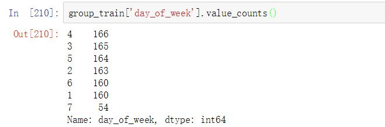

# 盐城市车管所上班时间

   [官网](http://ynz.122.gov.cn/views/helpMain.html?type=/views/help)显示如下
   
     盐城市公安局交通警察支队车辆管理所
    办理时间：周一至周六，上午9:00-12:00，下午2:00-5:00
     滨海县车辆管理所
    办理时间：周一至周六，上午9:00-12:00，下午14:30-17:30
     大丰区车辆管理所
    办理时间：周一至周六，上午9:00-12:00，下午14:30-17:30
     东台市车辆管理所
    办理时间：周一至周六，上午9:00-12:00，下午14:30-17:30
     阜宁县车辆管理所
    办理时间：周一至周六，上午9:00-12:00，下午14:30-17:30
     建湖县车辆管理所
    办理时间：周一至周六，上午9:00-12:00，下午14:30-17:30
     射阳县车辆管理所
    办理时间：周一至周六，上午9:00-12:00，下午14:30-17:30
     响水县车辆管理所
    办理时间：周一至周六，上午9:00-12:00，下午14:30-17:30
     盐都区车辆管理所
    办理时间：周一到周五，上午8:30-12:00，下午14:30-18:00

- 可以看出来,礼拜天车管所礼拜天并不上班,但是经过[百度](https://zhidao.baidu.com/question/1306842824007853699.html)
发现车管所按照国定假日来放假调休,那么也就解释了为什么礼拜天的数量非常少,但是还有的情况.
---

- 另外, train_data中三年里面有54天的礼拜天有数据, 这和正常调休的时间不一致，
因为就算加上所有调休最多一年不超过10天,这就很难解释了, 难道有些特种车辆可以在非工作日上牌? 还是不管了,

# 相关信息

盐城市统计局[官网](http://tjj.yancheng.gov.cn/SJFB/YDSJ/index.html)会有些数据

1. 汽车产量

    统计月报的第 5 页 : 汽车月销量
    
2. 居民生产总值
    
    统计月报的第 18 页 : 季度分县（市、区）城乡居民收入

# 数据预处理思路
   
   1. 假设每天各种车辆都有上牌量.
        
      这是显然的, 当然如果某些礼拜天没数据就假设不上班,那么就没有数据了. 
   
   2. 假设每天每种车类型之间会有一些比例上的关系.
   
      看到盐城交管所官网上明确得写着 `起亚车` 免费上牌. 这显然会比其他车会有优势, 所以会导致上牌数量上的差距.
      那如何找到他们之间的关系? 目前的想法是
       
      1. 比较 `365` 天的周期附近当天汽车销量值, 成比例的还原缺失值.
      
      `当前缺失值 = 365天之后附近的某个对应值X[(365天之后附近的某个对应未缺失值 - 当前未缺失值)/当前未缺失值]`
      
      2. 如果没有找到对应未缺失值, 那么就按照比例还原出缺失值.
      
      ` 比例 = 附近几周内的类型比例`
         
      **注意** ：这两个方法需要同时用, 并且有一个 `weight_paras` 来调整.
   
   3.假设车管所有一个人数饱和上限
      
      车管所的数目是一定的,他又自己的接待人数上限, 这点很重要,因为要预测未来,对于趋势的把控非常重要, 如果过于乐观或者过于悲观，
      都会导致结果的巨大差异, 所以在这种情况下, 首先应该考虑的是boundary, 其次是对于趋势的特征工程.

# 问题记录

1. 第二次提交mse是91w, 但是训练集上表现确很好.
   这个模型是用Prophet, 在3年的数据上训练出来的, 选模型的标准是参照三年总的MSE最小.
   而我最终选择的模型的MSE是37w左右, 这个就很难理解了, 在三年的表现很好但是预测下一年的表现就很差.
   后来想想, 可能是因为我拿所有的trian用做训练, model已经见过trian的数据所以可以表现很好, 最后可能导致对于训练集的biase.
   所以, 我今天又试了如果我在`两年的训练集上预测有Label的下一年`,结果mse惊人的一致, 于是我不得不怀疑在三年的训练集上训练出来的东西是否值得参考.
   目前想到的解决方案是先拿在1年test上表现最好的,然后再把这一年加进去训练.
       
   1. 车牌的填充数据可能有问题
    目前填充方法是每天的mean值填充,可以换成`单个brand的趋势`,但还是用一个模型, 最终合并成test_a的结果.
    
